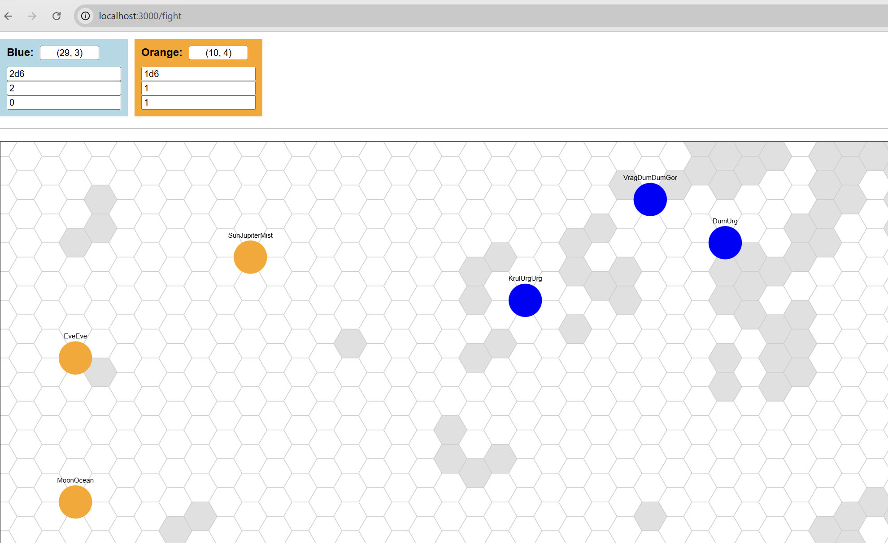

# dnd_related_toys
https://github.com/mulefish/dnd_related_toys/

# Dependancies: 
node + express

# DONE 1:
Orc and Elf creation
# DONE 2:
Viewport 

# TODO 1: 
Game mechanics (hitbox? range attack? other? How to move? etc)
# TODO 2: 
AI
# TODO 3: 
Genetic algo

# Screenshot:

